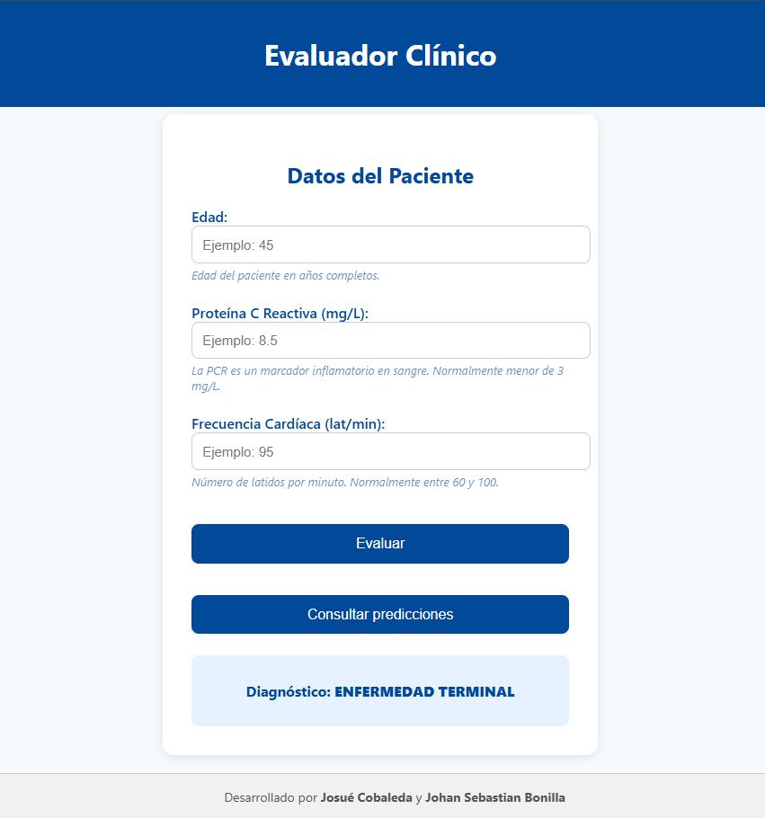
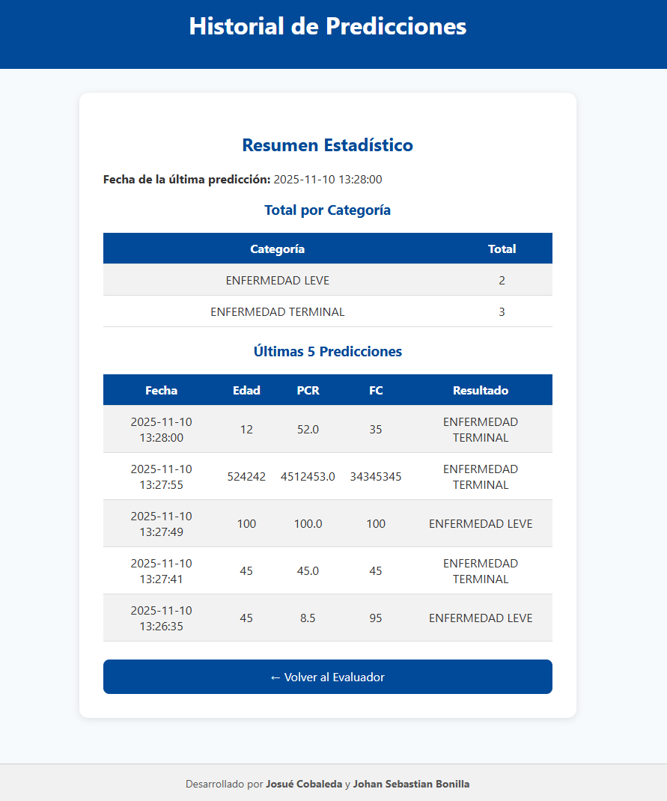

# Servicio de Predicción Clínica (Simulado) – Diseño de Pipeline MLOps (v2.0)

## 1. Contexto y objetivo

En muchos entornos clínicos se quiere contar con apoyo computacional para estimar el estado de salud de un paciente a partir de variables básicas (edad, biomarcadores, signos vitales, etc.).  
Este repositorio implementa un **servicio web de predicción clínica simulado**, que sirve como base para:

1. Demostrar cómo se podría **desplegar un modelo de ML** (o una simulación de él) usando **Python + Flask + Docker**.  
2. Definir un **pipeline de MLOps end-to-end** que, en una versión futura, permita:
   - Entrenar modelos reales con datos clínicos.
   - Versionar datos, modelos y código.
   - Desplegar el modelo de forma reproducible en local y en la nube.
   - Monitorear el comportamiento del modelo y **reentrenarlo** cuando sea necesario.

> ⚠️ **Advertencia:** Este sistema usa reglas determinísticas simples. **No es un dispositivo médico ni debe usarse para diagnóstico real.** Es sólo un prototipo educativo.

---

## 2. Descripción del problema

### 2.1 Enunciado 

Dado un conjunto de variables clínicas básicas introducidas por el profesional (por ejemplo, edad, proteína C reactiva, frecuencia cardiaca), el sistema devuelve un **estado clínico estimado** del paciente. Actualmente el “modelo” es una **función determinista** (reglas programadas), pero el diseño de MLOps está pensado para que en el futuro pueda sustituirse por un modelo de ML entrenado con datos reales.

### 2.2 Estados clínicos posibles

El servicio retorna uno de los siguientes estados clínicos:

- 🟢 **NO ENFERMO**  
- 🟡 **ENFERMEDAD LEVE**  
- 🟠 **ENFERMEDAD AGUDA**  
- 🔴 **ENFERMEDAD CRÓNICA**
- ⚫ **ENFERMEDAD TERMINAL**

Estos estados se calculan a partir de las entradas del usuario, siguiendo reglas definidas en el código.

---

## 3. Diseño del pipeline de MLOps (visión general)

Aunque este repositorio implementa solo una parte (el servicio de predicción simulado), el diseño global contempla un pipeline MLOps completo:

- Gestión y versionamiento de datos clínicos.
- Entrenamiento y experimentación de modelos.
- Empaquetado en contenedores Docker.
- Integración y entrega continua (CI/CD).
- Despliegue local y en la nube.
- Monitoreo y reentrenamiento.

---

### 3.1 Diagrama general del pipeline (Mermaid)

```mermaid
flowchart LR
    subgraph Datos_y_Features["Capa de datos y features"]
        D1[Fuentes de datos clínicos<br/>Historias, laboratorios, síntomas] 
        D2[(Almacenamiento seguro<br/>Data Lake / BBDD)]
        D3[(Versionado de datos<br/>DVC u otra herramienta)]
    end

    subgraph Entrenamiento_Offline["Entrenamiento offline y experimentación"]
        E1[EDA y preparación de datos<br/>Notebooks + pandas]
        E2[Entrenamiento de modelos<br/>scikit-learn / PyTorch / TensorFlow]
        E3[Registro de experimentos y modelos<br/>MLflow]
    end

    subgraph Contenerizacion["Empaquetado y entrega"]
        C1[Repositorio Git<br/>Código del servicio y del modelo]
        C2[CI: GitHub Actions<br/>Tests + build de imagen Docker]
        C3[(Registro de imágenes<br/>Docker Hub / ECR / GCR)]
    end

    subgraph Despliegue_y_Serving["Despliegue y servicio de predicción"]
        S1[Despliegue local<br/>Docker en PC del médico]
        S2[Despliegue en nube<br/>Cloud Run / ECS / AKS]
        S3[Servicio de predicción<br/>API Flask / interfaz web]
    end

    subgraph Monitoreo_y_CT["Monitoreo y reentrenamiento (CT)"]
        M1[Monitoreo técnico<br/>Logs, latencia, errores]
        M2[Monitoreo de modelo<br/>Métricas, deriva de datos]
        M3[Trigger de reentrenamiento<br/>Jobs programados / alertas]
    end

    D1 --> D2 --> D3 --> E1 --> E2 --> E3
    E3 --> C1 --> C2 --> C3
    C3 --> S1
    C3 --> S2
    S1 --> S3
    S2 --> S3
    S3 --> M1
    S3 --> M2
    M2 --> M3 --> E1

🔍 Nota: En este repositorio está implementado sobre todo el bloque S3 (servicio de predicción Flask) y su contenerización básica. El resto de bloques están descritos como diseño hipotético para una versión futura del sistema.

---

## 4. Componentes del pipeline (detalle)

### 4.1 Datos y preparación 

En una solución completa con datos reales:
- Se recopilarían datasets clínicos (síntomas, diagnósticos confirmados) en un Data Lake o base de datos segura.
- Se aplicaría versionamiento de datos con herramientas como DVC, para poder reconstruir qué dataset se usó para cada modelo.
- La preparación y análisis exploratorio se realizarían en notebooks de Jupyter usando pandas y librerías de visualización.
En este proyecto concreto, no se usan datos reales: solo se registran las predicciones simuladas en logs/predicciones.csv, que serviría como base para, en el futuro, entrenar realmente un modelo.

### 4.2 Entrenamiento y experimentación 

Cuando se disponga de datos reales, el flujo sería:
- Definir scripts de entrenamiento (train.py) en Python.
- Probar diferentes modelos (regresión logística, árboles, XGBoost, redes neuronales) con técnicas para manejar desbalance (enfermedades raras).
- Registrar cada experimento en MLflow (parámetros, métricas, artefactos), y seleccionar el mejor modelo para producción.
Actualmente, este repo solo tiene una función determinista que simula el modelo, pero el diseño ya está pensado para que puedas reemplazarla por un modelo real posteriormente.

### 4.3 Contenerización y CI/CD

Lo que ya está implementado
Dockerfile simple que construye una imagen con:
Python 3
Flask
El código del servicio (app.py)
La imagen se construye localmente y se ejecuta con:

##### Construir imagen
docker build -t servicio_medico:1.0 .

#### Ejecutar contenedor
docker run --rm -p 5000:5000 servicio_medico:1.0

Lo que se propone (diseño MLOps)
- Mantener el código en un repo Git (GitHub).
- Agregar un flujo de GitHub Actions con:
Instalación de dependencias.
Tests automatizados (por ejemplo, con pytest para probar la función de predicción y el endpoint Flask).
Construcción de la imagen Docker (p. ej. servicio_medico:<tag>).
Publicación opcional de la imagen en un registro de contenedores (Docker Hub / GitHub Container Registry / ECR / GCR).
Esto convertiría este servicio en un componente con entrega continua, listo para integrarse en un pipeline más grande.

### 4.4 Despliegue del servicio de predicción

Despliegue local (implementado). El escenario actual es:
- El médico/desarrollador ejecuta el contenedor en su máquina.
- Accede vía navegador a http://localhost:5000.
- Ingresa los datos clínicos en un formulario web.
- Recibe el estado clínico estimado y puede consultar el historial.

Despliegue en la nube (diseño futuro). La misma imagen Docker puede desplegarse en:
- Google Cloud Run, AWS ECS/Fargate o Azure Container Apps, como servicio de contenedores serverless: que permite escalado automático según número de peticiones y URL HTTPS pública para consumir el servicio desde aplicaciones hospitalarias.
- Como pod en un cluster Kubernetes (GKE, EKS, AKS) si se requiere una arquitectura más compleja y multi-servicio.

En ambos casos, el API Flask (o el formulario web) viviría dentro del contenedor y quedaría expuesto tras un balanceador de carga.

### 4.5 Monitoreo y reentrenamiento

Aunque este prototipo no incluye monitoreo avanzado, la arquitectura pensada contempla:
#### Monitoreo técnico:
- Logs de acceso y errores.
- Métricas de latencia y número de peticiones (por ejemplo, con Prometheus + Grafana o servicios nativos de la nube).
#### Monitoreo de modelo:
- Registro de entradas/salidas (ya se hace de forma básica en logs/predicciones.csv).
- En una versión real, comparación con diagnósticos verdaderos para calcular métricas en producción.
- Detección de deriva de datos usando herramientas como Evidently AI.
#### Reentrenamiento (CT – Continuous Training):
Jobs programados (cron, Cloud Scheduler, Airflow) que:
Toman los nuevos datos etiquetados.
Entrenan de nuevo el modelo.
Registran la nueva versión en MLflow.
Disparan el pipeline de CD para desplegar el modelo actualizado si supera ciertos umbrales.

---

## 5. Estructura del proyecto (estado actual del repo)

servicio_medico/
│
├── app.py              # Aplicación Flask: levanta el servidor, maneja rutas y lógica de predicción.
├── requirements.txt    # Dependencias de Python necesarias (Flask, etc.).
├── Dockerfile          # Define la imagen Docker del servicio.
├── templates/
│   ├── index.html      # Página principal (formulario para ingresar variables clínicas).
│   └── historial.html  # Página para ver el historial y estadísticas básicas.
├── logs/
│   └── predicciones.csv  # Archivo CSV donde se guardan las predicciones simuladas.
└── README.md           # Este documento.

En una evolución futura, podrían añadirse directorios como:
.github/workflows/ → pipelines de CI/CD.
infra/ → código de infraestructura (Terraform, etc.).
notebooks/ → exploración y EDA.
models/ → modelos entrenados y scripts de entrenamiento.

---

## 6. Ejecución local con Docker

### 6.1 Requisitos previos
Docker instalado y funcionando.
Opcionalmente, Python 3.10+ si se quiere ejecutar la app sin contenedor.
Sigue estos pasos para levantar la aplicación en tu computadora:

### 6.2. Construir la imagen

Desde la carpeta raíz del proyecto (donde está el `Dockerfile`), ejecuta este comando en la terminal:

```bash
docker build -t servicio_medico:1.0 .
```

Esto crea una imagen de Docker que contiene toda la aplicación y sus dependencias.


### 6.3. Ejecutar el contenedor

Una vez construida la imagen, ejecuta:

```bash
docker run --rm -p 5000:5000 servicio_medico:1.0
```

--rm: elimina el contenedor al detenerlo.
-p 5000:5000: expone el puerto 5000 del contenedor en el puerto 5000 local.

### 6.4. Acceder a la aplicación

Abre tu navegador web y escribe:

http://localhost:5000

Allí podrás ingresar los valores requeridos (edad, PCR, frecuencia cardíaca) y obtener el diagnóstico correspondiente.

Para ver el historial:

http://localhost:5000/historial

### 6.5. Detener la aplicación

Para cerrar la app, presiona Ctrl + C en la terminal donde la ejecutaste.

Esto detiene el contenedor y libera el puerto 5000.

---

## 7. Ejemplo de uso


| Variable                      | Descripción                  | Ejemplo |
| ----------------------------- | ---------------------------- | ------- |
| **Edad**                      | Años completos del paciente  | `45`    |
| **Proteína C Reactiva (PCR)** | Marcador inflamatorio (mg/L) | `8.5`   |
| **Frecuencia Cardíaca (FC)**  | Latidos por minuto           | `95`    |


Resultado esperado → ENFERMEDAD LEVE

En general, valores muy altos en PCR y FC, combinados con mayor edad, tenderán a devolver estados AGUDA, CRÓNICA o TERMINAL; valores normales o bajos tenderán a NO ENFERMO o ENFERMEDAD LEVE.

---

## 8. Historial de predicciones

Cada vez que se realiza una predicción, se registra una fila en logs/predicciones.csv con:
Fecha y hora.
Valores ingresados (edad, PCR, FC).
Estado clínico resultante.


### 8.1. Desde la página principal
En la interfaz donde realizas las predicciones hay un botón “Consultar predicciones”, que te lleva directamente a la vista con todas las estadísticas y predicciones recientes.
Ideal para los médicos que usan la app de forma visual.


### 8. 2. Accediendo directamente desde el navegador
Accede a:

http://localhost:5000/historial

Esto crea una imagen de Docker que contiene toda la aplicación y sus dependencias.


Allí se muestra:

- Número total de predicciones por categoría.
- Últimas 5 predicciones realizadas.
- Fecha del último registro.

---

## 9. Interfaz Web

La aplicación incluye una interfaz médica limpia desarrollada con HTML y CSS:

Campos de entrada con descripciones y ejemplos.

Diagnóstico mostrado de forma clara y visual.




---

## 10. Tecnologías usadas

Implementadas en este repositorio
- 🐍 Python 3.10+
- 🌶 Flask (microframework web para la API y la interfaz HTML).
- 🧱 HTML5 / CSS3 (plantillas básicas para la UI).
- 🐳 Docker (contenerización del servicio).
- 📁 CSV para logging simple del historial de predicciones.

Propuestas para una versión MLOps completa
Estas tecnologías no están todavía en el código, pero son parte del diseño de MLOps:
- Git + GitHub / GitLab: control de versiones del código y colaboración.
- GitHub Actions / GitLab CI / Jenkins: pipelines de CI/CD para testear y construir imágenes automáticamente.
- DVC: versionamiento de datasets clínicos.
- MLflow: tracking de experimentos y registro de modelos.
- Terraform: definición de infraestructura en la nube como código (clusters, servicios, redes).
- Servicios de contenedores en la nube: Google Cloud Run, AWS ECS/Fargate, Azure Container Apps, Kubernetes (GKE/EKS/AKS).
- Monitoreo y observabilidad: Prometheus + Grafana, o soluciones nativas (Cloud Monitoring, CloudWatch). Evidently AI para detección de deriva en datos/modelo.

---

## 12. CHANGELOG (respecto al README original)

- Se agregó una sección de contexto, problema y objetivos para alinear el proyecto con un caso clínico simulado.
- Se incorporó un diseño de pipeline MLOps end-to-end (con diagrama Mermaid) que antes no existía.
- Se separó claramente qué partes están implementadas (servicio Flask + Docker + historial CSV) y qué partes son diseño futuro (ML real, CI/CD, nube, monitoreo, reentrenamiento).
- Se enriqueció la descripción de tecnologías, incluyendo herramientas vistas en el curso: GitHub Actions, DVC, MLflow, Terraform, servicios serverless de contenedores, Prometheus/Grafana, Evidently, etc.
- Se reorganizó el contenido en secciones numeradas (contexto, pipeline, estructura, ejecución, tecnologías, supuestos) siguiendo el estilo del ejemplo presentado en el curso.
- Se mantuvieron los ejemplos de uso, la explicación de la interfaz y la advertencia de que el sistema es solo simulado, pero con redacción más alineada al enfoque MLOps.

## Autores

* Josué Cobaleda
* Johan Sebastian Bonilla

---

Este proyecto es demostrativo y no debe utilizarse para diagnósticos médicos reales.
